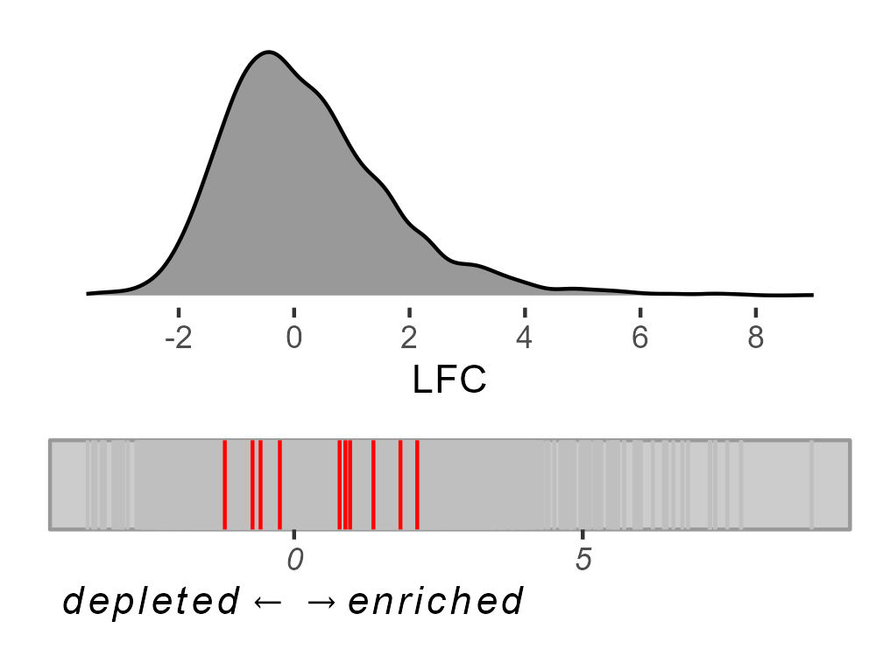
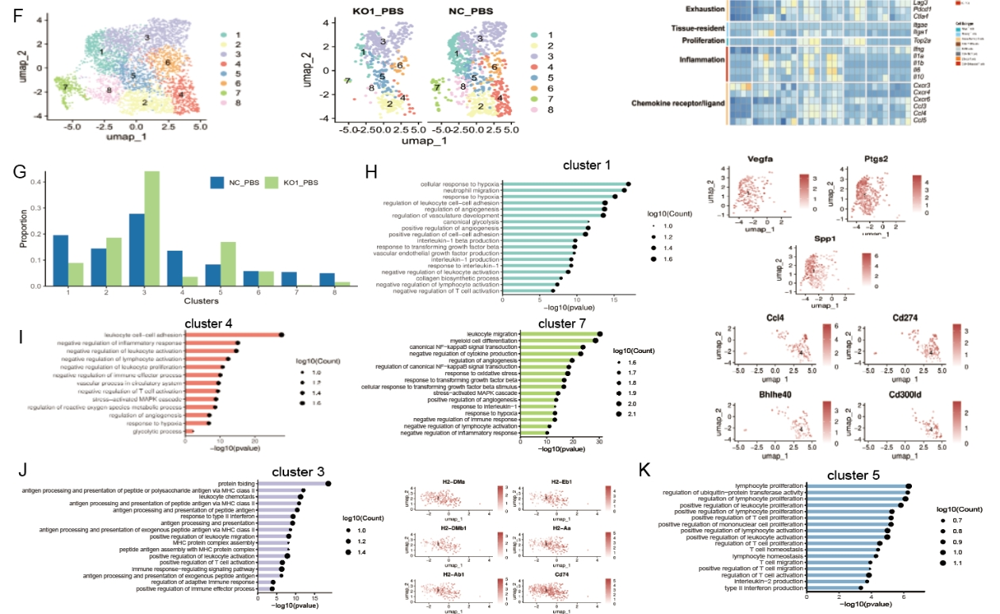

## 项目成果展示：胃癌多组学研究设计

[点击此处查看高清PDF原图](Gastric_Cancer_Study_Design.pdf)

::: {.scroll-box style="max-height: 75vh; overflow-y: auto; border: 1px solid #ddd; padding: 1em; margin: auto;"}
```{mermaid, echo=FALSE}
graph TB;

    subgraph Phase I: Data Collection & Pre-processing
        direction TB;
        Data_SC["<b>scRNA-seq Datasets</b><br/>(GSE datasets)<br/><i>Identification of cell types</i>"];
        Data_Bulk["<b>Bulk Transcriptome</b><br/>Training: TCGA-gastric cancer<br/>Validation: GEO Cohorts"];
        Data_Multi["<b>Multi-omics Data</b><br/>Mutation, CNV, Methylation<br/>HPA (IHC), Drug Databases"];
    end

    subgraph Phase II: Identification of FRGs
        direction TB;
        Step_Clustering["Seurat Clustering & SingleR Annotation<br/>(Immune, Stromal, Malignant cells)"];
        Step_Screening["Screening Fibroblast-Related Genes (FRGs)<br/>High expression in fibroblast clusters"];
        Step_Validation["Cross-Validation<br/>(TISCH DB & Correlation with<br/>xCell/MCP-counter)"];
        Node_54FRGs{"<b>Candidate FRGs</b><br/>Identified"};
    end
    
    subgraph Phase III: FRGI Model Construction
        direction TB;
        Step_Omics["Multi-omics Characterization<br/>(Diff. Exp, Mutation, CNV, Methylation)"];
        Step_Drug["Clinical Value Assessment<br/>(PubTator, TDL, Gene Dependency Score)"];
        Step_ML["<b>Machine Learning Selection</b><br/>10 Algorithms Integration<br/>(Lasso, Ridge, RF, GBM, Boruta, etc.)"];
        Node_3Genes{"<b>Core Signature (FRGI)</b>"};
    end

    subgraph Phase IV: CD8+ T-cell - Fibroblast Subtyping
        direction TB;
        Step_Class1["<b>FRG Subtyping</b><br/>Fibroblast Hot vs. Cold"];
        Step_Mechanism["Mechanism Analysis<br/>GSEA, GSVA, TIDE (Immunotherapy)"];
        Step_Class2["<b>Dual-Factor Subtyping<br/>Construction</b><br/>CD8+ T-cell Activity <b>x</b> FRG Status"];
        Outcome_4Types["<b>Four Molecular Subtypes</b><br/>CD8+FH, CD8+FC, CD8-FH, CD8-FC"];
    end

    Step_Nomogram["Nomogram Construction<br/>FRGI + Clinical Variables"];
    Step_SurvVal["Survival Validation<br/>(TCGA, GEO, Pan-cancer)"];
    Outcome_Therapy["<b>Therapeutic Strategy Map</b><br/>Precision Medicine Guidance<br/>(Immuno/Chemo/Targeted Therapy)"];

    Data_SC --> Step_Clustering;
    Step_Clustering --> Step_Screening;
    Step_Screening --> Step_Validation;
    Step_Validation --> Node_54FRGs;
    
    Node_54FRGs --> Step_Omics;
    Node_54FRGs --> Step_Drug;

    Data_Multi --> Step_Omics;
    
    Step_Omics --> Step_ML;
    Step_Drug --> Step_ML;
    Data_Bulk -- "Expression Data" --> Step_ML;
    
    Step_ML --> Node_3Genes;
    Node_3Genes --> Step_Nomogram;
    Node_3Genes --> Step_SurvVal;
    
    Node_3Genes --> Step_Class1;
    Step_Class1 --> Step_Mechanism;
    Step_Mechanism -- "Integrate with<br/>CD8+ T-cell Signature" --> Step_Class2;
    Step_Class2 --> Outcome_4Types;
    
    Outcome_4Types --> Outcome_Therapy;
    Step_Nomogram -. "Clinical Prediction" .-> Outcome_Therapy;
    Step_SurvVal --> Outcome_Therapy;

    %% Styling
    style Data_SC fill:#E3F2FD,stroke:#1565C0,stroke-width:1.5px;
    style Data_Bulk fill:#E3F2FD,stroke:#1565C0,stroke-width:1.5px;
    style Data_Multi fill:#E3F2FD,stroke:#1565C0,stroke-width:1.5px;

    style Step_Clustering fill:#E0F2F1,stroke:#00695C,stroke-width:1.5px;
    style Step_Screening fill:#E0F2F1,stroke:#00695C,stroke-width:1.5px;
    style Step_Validation fill:#E0F2F1,stroke:#00695C,stroke-width:1.5px;
    style Node_54FRGs fill:#B2DFDB,stroke:#00695C,stroke-width:1.5px;

    style Step_Omics fill:#FFF3E0,stroke:#EF6C00,stroke-width:1.5px;
    style Step_Drug fill:#FFF3E0,stroke:#EF6C00,stroke-width:1.5px;
    style Step_ML fill:#FFF3E0,stroke:#EF6C00,stroke-width:1.5px;
    style Node_3Genes fill:#FFE0B2,stroke:#EF6C00,stroke-width:1.5px;

    style Step_Nomogram fill:#F3E5F5,stroke:#6A1B9A,stroke-width:1.5px;
    style Step_SurvVal fill:#F3E5F5,stroke:#6A1B9A,stroke-width:1.5px;
    
    style Step_Class1 fill:#FFEBEE,stroke:#C62828,stroke-width:1.5px;
    style Step_Mechanism fill:#FFEBEE,stroke:#C62828,stroke-width:1.5px;
    style Step_Class2 fill:#FFEBEE,stroke:#C62828,stroke-width:2.5px;

    style Outcome_4Types fill:#FAFAFA,stroke:#333333,stroke-width:1.5px;
    style Outcome_Therapy fill:#FAFAFA,stroke:#333333,stroke-width:1.5px;
```
:::

------------------------------------------------------------------------

<!--# class="center middle" -->

## 项目成果展示：生信可视化

{.diff height="80%"}

------------------------------------------------------------------------

<!--# class="center middle" -->

## 项目成果展示：单细胞分析可视化



------------------------------------------------------------------------

<!--# class="center middle" style="text-align: center;" -->

## `easybio`

一个简化、可交互的单细胞数据注释R包

------------------------------------------------------------------------

### 背景与痛点

#### 单细胞注释：从数据到结论的关键瓶颈

*   **手动注释**: 耗时、主观、可复现性差。

*   **自动化工具**: 效率高，但通常是“黑盒”，结果难以验证，缺乏可信度。

::: callout-important
如何平衡效率与可靠性，是单细胞注释的核心挑战。
:::

------------------------------------------------------------------------

### `easybio` 解决方案：透明化三步工作流

1.  **自动化匹配 (`matchCellMarker2`)**
    *   输入Marker基因，快速获取候选细胞类型。

2.  **交互式验证 (`check_marker` & `plotSeuratDot`)**
    *   **溯源 (Why?)**: 我的哪些基因匹配上了？
    *   **求证 (Is it Correct?)**: 经典Marker表达了吗？

3.  **手动确认 (`finsert`)**
    *   基于可视化证据，自信地完成最终命名。

> 整个流程可通过 `|>` 管道符一气呵成，代码直观、逻辑清晰。

------------------------------------------------------------------------

### 技术亮点与优势

*   **透明可信**
    *   解决了自动化注释的“黑盒”问题，每一步决策都有据可依。

*   **灵活易用**
    *   管道化(Pipe-friendly)操作，支持通用及自定义Marker数据库。

*   **现代规范**
    *   遵循现代R包开发实践，代码结构清晰，易于维护。
    *   利用 `litedown` 构建项目Vignette，提供轻量、现代化的使用文档。

------------------------------------------------------------------------

<!--# class="center middle" -->

### Q & A {.unnumbered}

#### Thank You

```{css, echo=FALSE}
/* 强制隐藏由 snap.js 意外创建的 spacer 元素 */
div.spacer {
  display: none !important;
}
```
